# Phillies Applied Biomechanics Velocity Projection Report

# 1. Executive Summary

The objective of this study was to identify which pitcher in the 2025 Florida Complex League (FCL) cohort is most likely to throw the hardest pitch five years from now. Because future velocity cannot be observed directly, the analysis focused on the biomechanical characteristics associated with future velocity potential rather than current velocity alone.

The central hypothesis was that pitchers capable of generating, storing, and transferring force more efficiently through the kinetic chain would possess greater long-term velocity potential. To evaluate this hypothesis, biomechanical archetype discovery, machine-learning prediction, comparable-pitcher analysis, pairwise ranking models, posterior uncertainty estimation, and extreme-value projection were combined into a unified evaluation framework. Rather than relying on a single model, final rankings were based on agreement across multiple independent analytical approaches.

Three complementary ranking methods were developed. The first used machine learning to estimate velocity potential directly from biomechanical measurements. The second evaluated pitchers relative to mechanically similar historical players. The third learned relative pitcher ordering through pairwise comparisons. Rankings were combined into a consensus framework and subsequently propagated through a posterior simulation and extreme-value projection process to estimate future velocity ceilings.

A cornerstone finding was not the identification of a single pitcher, but the repeated convergence of independent analytical methods on the same underlying biomechanical signal. Across biomechanical archetypes, feature selection, model explainability, comparable-pitcher analysis, ranking validation, and extreme-value projection, the highest-ranked pitchers consistently distinguished themselves through characteristics associated with lower-body force generation and the subsequent acceleration and transfer of rotational energy through the kinetic chain.

Pitcher 212 emerged as the top overall prospect, with a projected velocity ceiling of 98.66 mph. Pitchers 132 and 154 followed closely behind and reinforced the same biomechanical theme through exceptional rotational characteristics. Collectively, the highest-ranked pitchers demonstrated unusually strong indicators of lower-body-driven rotational power generation, including force loading, rotational acceleration, and rotational separation.

Forecasting velocity five years into the future necessarily involves substantial uncertainty. Future development depends on factors that are not captured within the available biomechanical dataset, including biological maturation, strength development, training environment, injury history, coaching interventions, workload management, and individual adaptation to professional development systems. Rather than treating future velocity as a single deterministic prediction, uncertainty was explicitly incorporated through bootstrap posterior estimation, population-based development modeling, pitch-to-pitch variability, and extreme-value simulation.

The resulting extreme-value projections suggest that the highest-ranked pitchers possess future velocity ceilings approaching 100 mph. For Pitcher 212, the top overall prospect, the upper bound of this projection reaches 103.23 mph, the highest of any pitcher in the cohort, while Pitchers 132 and 154 follow closely with upper bounds of 99.95 mph and 101.22 mph, respectively. Importantly, these projections should not be interpreted as guarantees of future performance. Instead, they represent the velocity outcomes that become plausible if current biomechanical characteristics are combined with successful physical development and continued progression over the next five years. Given the increasing prevalence of professional pitchers reaching or exceeding 100 mph in modern baseball, these projected ceilings remain within the range of realistic future outcomes for the highest-ranked prospects.

The primary conclusion of this study is that elite future velocity potential is strongly associated with the ability to generate, store, and transfer rotational force from the lower half through the pitching delivery. Most importantly, this conclusion emerged repeatedly across multiple independent analytical frameworks, providing confidence that the rankings reflect meaningful biomechanical signal rather than model-specific artifacts.

# 2. Introduction, Data Summary, and Exploratory Analysis

Two datasets were provided for this analysis. The first contained biomechanical measurements and observed pitch velocity for 203 pitchers across 8,981 pitches and served as the labeled training dataset. The second contained biomechanical measurements for the 2025 FCL cohort but did not include velocity measurements, making supervised prediction a challenge. Consequently, the labeled dataset was used to learn the relationship between biomechanics and velocity, while the FCL dataset served as the target population for projection.

Furthermore, important developmental variables such as age, physical maturation, training history, injury history, and strength gains are unavailable. As a result, the problem is reframed as one of velocity potential rather than deterministic forecasting. The goal is therefore to identify biomechanical characteristics associated with elite velocity production and use those characteristics to rank pitchers according to their projected future ceiling.

Initial exploratory analysis revealed substantial complexity within the biomechanical feature space. Many measurements were highly correlated, reflecting the fact that pitching mechanics operate as an integrated movement system rather than a collection of independent joint actions. Strong clusters emerged among variables describing rotational mechanics, lower-body loading, hip-shoulder separation, trunk posture, and arm acceleration. This observation reinforced the central kinetic-chain hypothesis and suggested that meaningful information may exist at the level of coordinated movement patterns rather than individual biomechanical measurements alone.

## 2.1 Velocity Distribution and Effects

Within the labeled dataset, 2024 observations correspond primarily to rookie-ball competition (n = 1,609 pitches), while 2025 observations correspond primarily to Single-A competition (n = 7,372 pitches). Mean velocity increased from 91.54 mph in 2024 to 92.65 mph in 2025. This difference should not be interpreted as a pure developmental effect. Only 10 of the 203 pitchers appear in both seasons, allowing a direct within-player comparison. Among these dual-year pitchers, the average velocity increase was approximately +0.62 mph. Players reaching higher levels of competition are generally those already possessing stronger performance characteristics, creating a cohort-level confound.

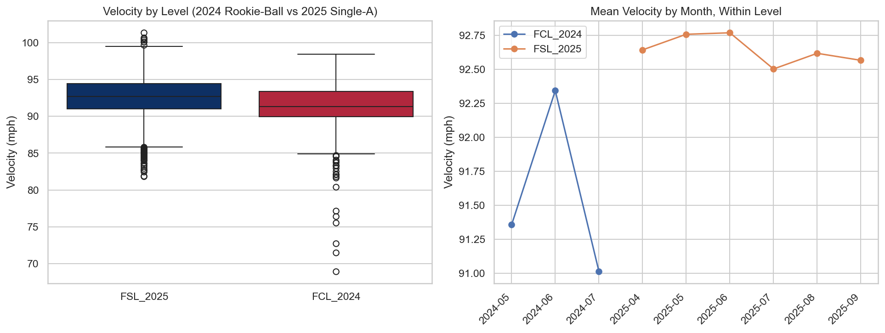{width=80%}

**Figure 1:** *Pitch velocity by competition level, illustrating the level/promotion confound between 2024 rookie-ball and 2025 Single-A observations.*

## 2.3 Initial Biomechanical Signals

The first step in understanding velocity production was to examine individual biomechanical variables and their relationship with observed velocity. Correlation analysis revealed that the strongest univariate relationships were associated with measures of torso posture, trunk control, and rotational speed. Variables such as torso side-bend, torso forward bend, torso rotational velocity, and elbow extension velocity consistently appeared among the strongest individual predictors.

Many biomechanical variables participate in the same movement sequence, meaning that individual measurements may appear only modestly related to velocity when examined in isolation despite contributing substantially within a larger movement pattern.

Consequently, correlation analysis was treated as a useful screening tool rather than a definitive measure of biomechanical importance. This observation motivated later analyses focused on biomechanical systems, latent movement factors, and movement archetypes rather than relying solely on individual feature relationships.

*Figures 2-4* show the underlying distributions and confirm the correlation structure holds both across pitchers and within a single pitcher's own outings.

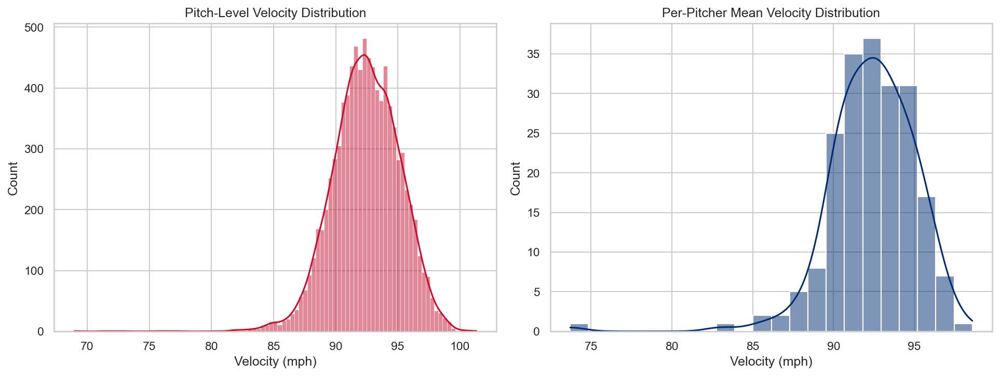{width=80%}

**Figure 2:** *Distribution of observed pitch velocity across the labeled dataset.*

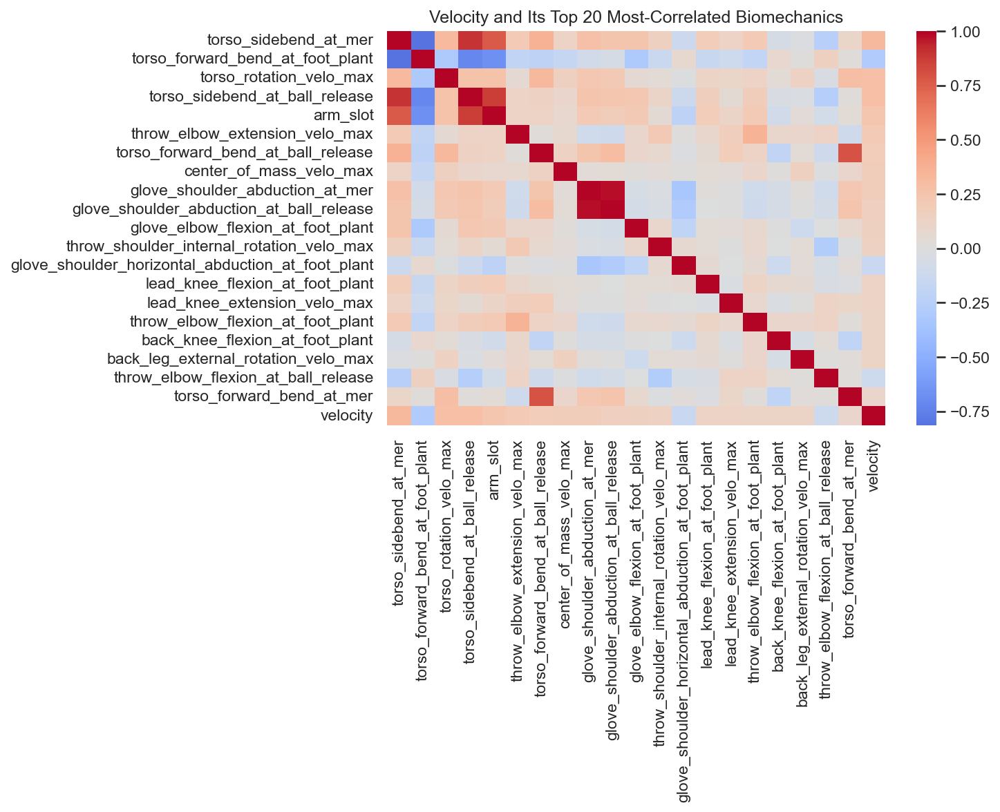{width=80%}

**Figure 3:** *Pearson correlation heatmap between biomechanical measurements and observed velocity, identifying the strongest univariate predictors.*

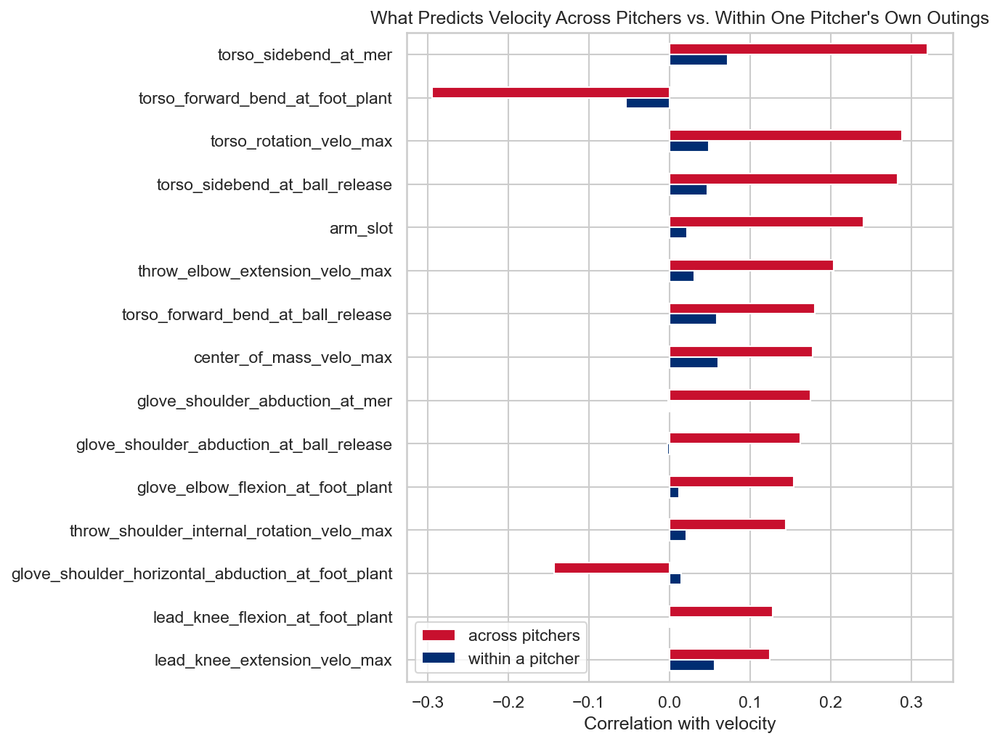{width=80%}

**Figure 4:** *Comparison of pooled (across-pitcher) and within-pitcher correlations, confirming the correlation structure holds at both levels.*

## 2.4 Sampling Representation and Considerations
The distribution of observations across pitchers is highly uneven. The ten most frequently observed pitchers account for approximately 27.3% of all pitches in the labeled dataset. Without correction, machine-learning models trained directly on pitch-level data would naturally place greater emphasis on these heavily represented pitchers, potentially learning pitcher-specific tendencies rather than general biomechanical principles.

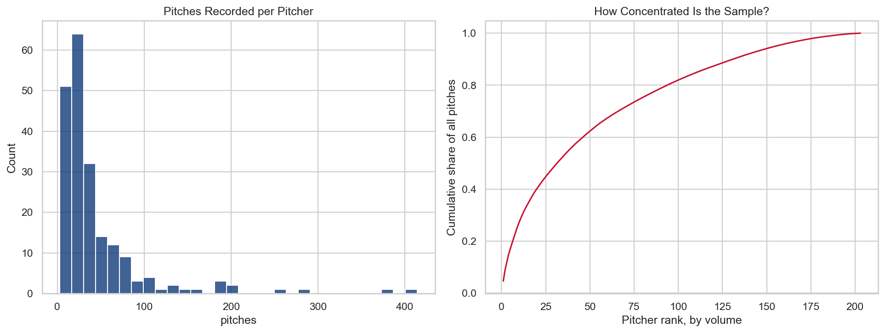{width=80%}

**Figure 5:** *Pitch counts by pitcher in the labeled dataset, showing that the ten most-observed pitchers account for roughly 27% of all recorded pitches.*

To mitigate overrepresentation, all predictive modeling and validation procedures were performed using pitcher-grouped cross-validation. This ensures that pitches from the same pitcher never appear in both training and validation folds. In addition, inverse pitch-count weighting was evaluated to reduce the influence of heavily represented pitchers during model fitting. The idea is that model performance reflects the ability to generalize across pitchers, rather than memorize mechanics.

## 2.5 Kinetic Chain Hypothesis

The central biomechanical hypothesis of this study is that velocity emerges through efficient energy transfer along the kinetic chain. In a typical pitching delivery, force is generated by the lower body, transferred through the pelvis and trunk, and ultimately expressed through the throwing arm and baseball. If this energy-transfer process is truly responsible for elite velocity production, then a feature capturing sequencing efficiency should provide meaningful predictive information beyond any individual biomechanical measurement.

To evaluate this idea, a kinetic-chain efficiency metric was constructed using rotational velocity relationships between successive body segments.

The composite kinetic-chain score exhibited a near-zero correlation with velocity (r = 0.017), substantially weaker than several constituent mechanics variables, including torso rotational velocity (r = 0.288) and torso side-bend at maximum external rotation (r = 0.321). While conceptually appealing, the resulting metric exhibited only a weak direct relationship with velocity and underperformed several of its individual component variables, most notably torso rotational velocity. The kinetic-chain hypothesis remained plausible, but the specific proxy constructed from peak rotational velocity ratios did not capture it effectively in this dataset. 

Furthermore, the sequencing variables did not emerge as dominant predictors during subsequent feature-selection and modeling stages. Modeling focused on higher-level movement patterns, biomechanical systems, and mechanical archetypes rather than a single hand-crafted efficiency metric.

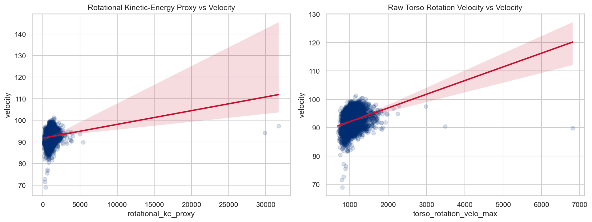{width=80%}

**Figure 6:** *Relationship between the composite kinetic-chain sequencing score and observed velocity, compared against its individual component variables.*

## 2.6 Other Findings
Velocity trends within individual outings were also examined to determine whether meaningful fatigue effects were present. Across the population, average velocity drift was approximately -0.0075 mph per pitch, indicating minimal aggregate evidence for same-day fatigue. While individual pitchers occasionally exhibited meaningful velocity changes during an outing, these effects were not sufficiently consistent across the population to serve as a strong predictive feature.

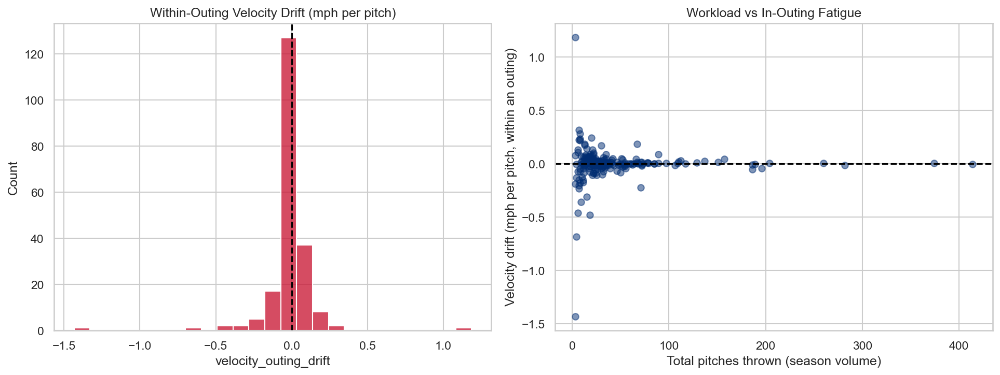{width=80%}

**Figure 7:** *Within-outing velocity drift across the labeled population, showing minimal aggregate evidence of same-day fatigue.*

Development trends were similarly explored through the subset of pitchers appearing across multiple seasons. While the sample size was limited, these analyses provided preliminary evidence that developmental trajectories may contain useful information beyond current biomechanical state alone.

Collectively, meaningful biomechanical signal exists within the dataset; however, much of that is distributed across groups of correlated variables. Pitching mechanics operate as an integrated movement system consistent with the kinetic-chain framework. These findings motivated modeling focused on biomechanical systems, latent movement factors, and mechanical archetypes rather than relying on exclusive raw measurements. 

This naturally raises the next question: how can higher-level representations of energy generation, transfer, and expression throughout the pitching delivery be identified?

# 3. Discovering Mechanical Archetypes

While individual biomechanical variables provide useful insight, pitching velocity is ultimately produced through coordinated movement patterns rather than isolated joint actions. The objective of this section is therefore not to identify the single most important biomechanical variable, but rather to determine whether distinct mechanical archetypes exist and whether those archetypes exhibit different velocity profiles.

Rather than assume every pitcher's mechanics matter in the same way, UMAP was applied to the pooled biomechanical dataset containing both labeled and FCL-2025 pitchers, reducing each pitcher's biomechanical profile into a two-dimensional latent representation. Velocity was excluded from the embedding process so that archetypes would be defined entirely by movement characteristics rather than performance outcomes.

K-Means clustering was then applied within the embedded space, producing seven interpretable biomechanical archetypes (silhouette = 0.354).

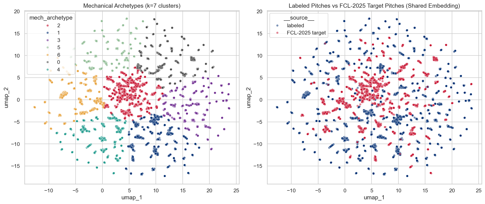{width=80%}

**Figure 8:** *UMAP embedding of pooled labeled and FCL-2025 biomechanics, colored by the seven K-Means mechanical archetypes.*
The embedding shows both cohorts side by side. Mean labeled-data velocity by archetype:

## 3.1 Archetypes Capture Velocity Signal

A notable result is that velocity differences emerged naturally across archetypes despite velocity never being used during clustering. Mean velocity varied from approximately 91.5 mph to 94.2 mph across groups, suggesting that the embedding successfully captured movement patterns associated with velocity production rather than arbitrary biomechanical variation. This provides evidence that meaningful biomechanical structure exists within the population and that pitchers can be grouped according to distinct movement strategies.

Most importantly, the archetype framework provides a mechanism for identifying future velocity potential beyond current observed velocity. Rather than evaluating pitchers solely through individual mechanics variables, pitchers can be compared against mechanically similar peers and evaluated according to the velocity distributions historically associated with their movement profile. This perspective becomes a foundational component of the ranking framework developed in later sections.

More broadly, the archetype analysis suggests that there is no single blueprint for elite velocity. Multiple movement profiles can produce high-end velocity outcomes, but the highest-performing archetypes consistently exhibit characteristics associated with efficient energy generation and transfer. As later sections demonstrate, pitchers with exceptional lower-body force generation, rotational acceleration, and separation characteristics are represented among the highest-ranked future velocity projections.

This remains one of the strongest pieces of evidence in the analysis that meaningful biomechanical structure exists within the data and that coordinated movement patterns capture information beyond individual biomechanical measurements:

|   mech_archetype |   mean_velocity |
|------------------:|----------------:|
|                6 |           94.17 |
|                5 |           92.99 |
|                1 |           92.36 |
|                3 |           92.13 |
|                0 |           92.08 |
|                4 |           92.02 |
|                2 |           91.51 |

# 4. Building Candidate Feature Sets

Before committing to a final feature set, several competing hypotheses were evaluated. Aggressively expanding the feature space would increase variance and reduce interpretability without guaranteeing improved predictive performance. 

The first hypothesis was that the raw biomechanical measurements alone contain sufficient information to explain velocity. The second was that engineered features motivated by biomechanics and physics—such as kinetic-chain proxies, stride-efficiency metrics, and sequencing variables—would provide additional predictive signal beyond the raw measurements. The third was that biomechanical archetypes capture higher-order movement patterns that individual variables cannot represent directly.

To test these ideas, three candidate feature sets were compared using GroupKFold cross-validation on pitcher identity, inverse pitch-count sample weighting, and three model families (XGBoost, Random Forest, and Elastic Net). The feature sets consisted of: (1) raw biomechanical measurements only, (2) raw measurements plus engineered biomechanical features, and (3) raw measurements plus biomechanical archetype assignments derived from the UMAP clustering.

The results revealed a consistent pattern. These results suggest that broad movement patterns captured by the archetype framework were more informative than the individual hand-crafted biomechanical proxies. In other words, broad movement patterns appeared more informative than individual engineered transformations, reinforcing the hypothesis of mechanical archetypes.

Across all model families, XGBoost produced the strongest predictive performance, while the biomechanical archetype feature set achieved the best overall validation error (CV RMSE = 2.45 mph).

These findings shaped the remainder of the analysis. Rather than assuming that more features would improve performance, the next step focused on identifying a smaller set of stable and interpretable predictors capable of capturing the biomechanical characteristics most consistently associated with velocity production.

## 4.1 Disciplined Feature Selection

To determine which variables were genuinely robust, bootstrap stability selection was performed using both Lasso regression and XGBoost. The dual-selection framework was designed to capture features important under both linear and nonlinear relationships. Features repeatedly selected across bootstrap resamples were retained, while unstable features were discarded regardless of apparent importance in any single model fit.

Several notable patterns emerged. Most engineered transformations failed to demonstrate consistent value, reinforcing earlier evidence that many hand-crafted biomechanical proxies were weaker than anticipated. However, a small number of features repeatedly survived selection, including torso-control-by-rotation interactions and stride-length transformations motivated by biomechanical scaling principles. More importantly, the final feature set consistently retained variables associated with rotational acceleration, trunk control, separation mechanics, biomechanical archetype identity, and movement consistency measures.

The resulting feature set balanced predictive performance, biomechanical interpretability, and model stability. Rather than relying on dozens of highly correlated biomechanical measurements, the final framework concentrated on a smaller collection of features that repeatedly demonstrated signal across multiple validation procedures and modeling approaches.

Most importantly, the features that survived selection were not random. Variables associated with rotational acceleration, trunk control, separation mechanics, lower-body movement, and biomechanical archetype identity appeared repeatedly throughout the analysis. This recurring pattern suggested that the same underlying biomechanical themes were emerging regardless of methodology, motivating a deeper examination of how those features influenced model predictions.

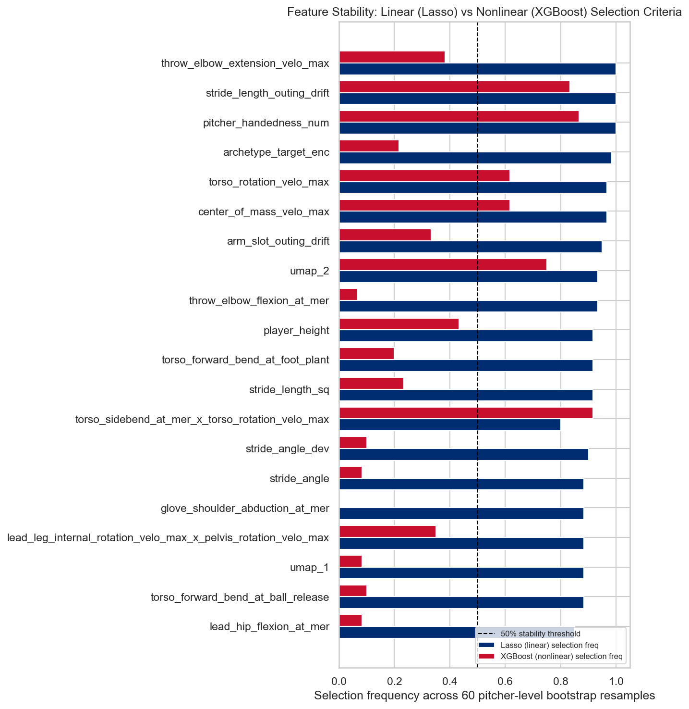{width=80%}

**Figure 9:** *Bootstrap stability-selection frequency for each candidate feature under both the linear (Lasso) and nonlinear (XGBoost) selection criteria.*

# 5. Model Results and Explainability

The objective of this analysis was not to identify the single best predictive model, but rather to identify pitchers who consistently demonstrate future velocity potential across multiple independent evaluation frameworks. 
Three independent ranking methods were developed. Each evaluates future velocity potential from a different perspective and contributes a separate estimate of a pitcher's future upside. Rather than relying on a single prediction, this analysis was designed around the principle of convergence: pitchers repeatedly identified as high-upside across multiple independent methodologies provide stronger evidence than pitchers elevated by any one model alone.

The final ranking is based not on the output of a single model, but on the degree of agreement among these independent approaches. This shifts the focus from predicting an exact future velocity to identifying pitchers who consistently occupy the upper tail of plausible future outcomes.

## 5.1 Method A: Biomechanical Prediction Model

The first approach used supervised machine learning to predict velocity directly from biomechanical measurements. Following archetype discovery and stability-based feature selection, an XGBoost regression model was trained using rotational, separation, trunk-control, movement-consistency, and biomechanical archetype features.

Model performance was evaluated using 5-fold GroupKFold cross-validation grouped by pitcher identity to prevent pitcher-level information leakage across training and validation sets.

| Model | CV RMSE | CV R² |
|---|---:|---:|
| XGBoost | 2.471 | 0.132 |
| Random Forest | 2.579 | 0.054 |
| Elastic Net | 2.624 | 0.028 |
| Neural Network (MLP) | 3.531 | -0.824 |

XGBoost consistently produced the strongest predictive performance and was therefore selected as the primary regression model. While the resulting R² was modest, this was expected given the substantial pitch-to-pitch variability arising from factors not captured by the biomechanical measurements alone, including effort level, fatigue, pitch intent, pitch type, and measurement noise.

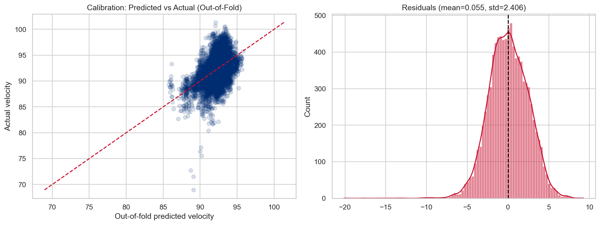{width=80%}

**Figure 10:** *Out-of-fold predicted versus actual velocity, with residuals checked for systematic bias across the prediction range.*

To better understand model behavior, SHAP (SHapley Additive exPlanations) values were computed using TreeSHAP. The most influential features consistently involved rotational acceleration, trunk control, lower-body movement, and biomechanical archetype identity. Notably, the interaction term between torso sidebend at maximum external rotation and torso rotational velocity emerged as the strongest overall contributor. These findings reinforced the recurring biomechanical themes identified throughout the project and provided an interpretable connection between the statistical model and pitching mechanics.

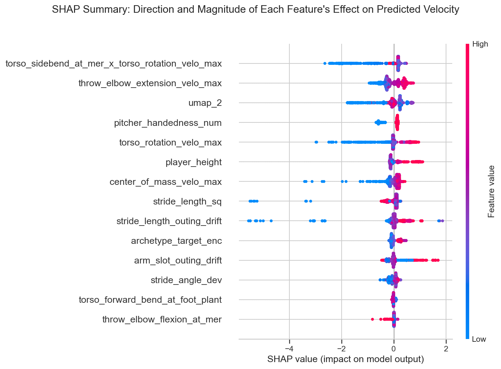{width=80%}

**Figure 11:** *SHAP summary plot showing the direction and magnitude of each feature's effect on predicted velocity.*

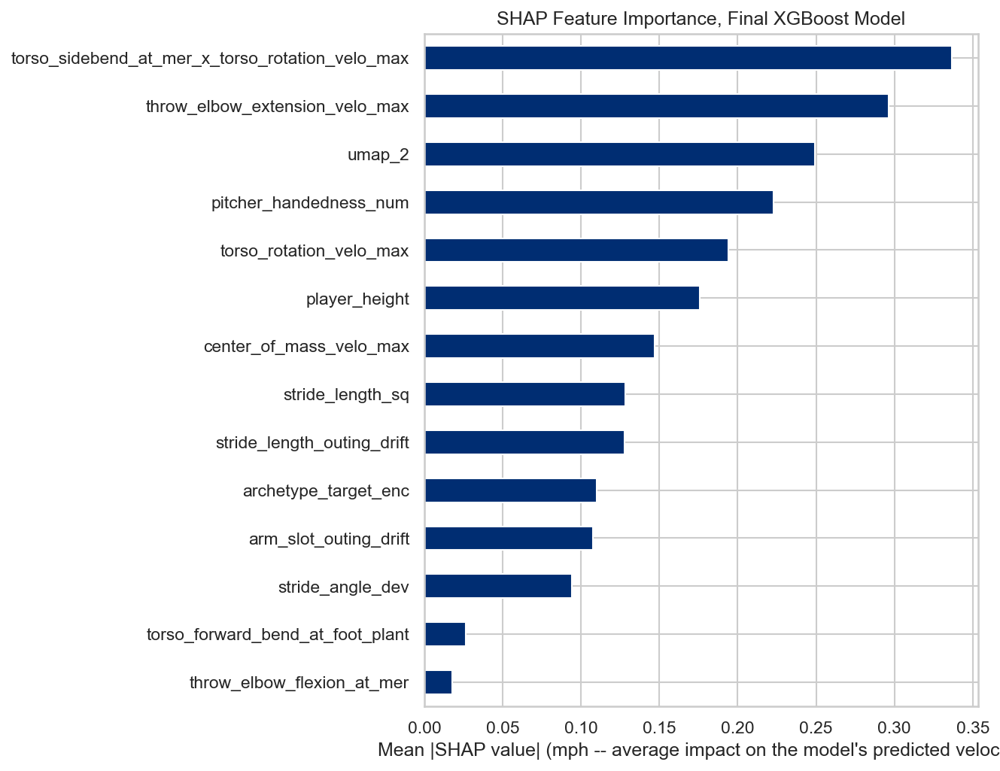{width=80%}

**Figure 12:** *Mean absolute SHAP value for each feature in the final XGBoost model, ranked by overall importance.*

## 5.2 Method B: Nearest-Neighbor Biomechanical Comparables

The second approach evaluated pitchers through biomechanical similarity rather than direct velocity prediction. Using the reduced biomechanical feature space, each pitcher was matched to mechanically similar pitchers using a k-nearest-neighbor (KNN) framework.

Future velocity potential was then estimated from the velocity characteristics of those comparable pitchers. Unlike the machine-learning model, the KNN framework does not learn a global relationship between biomechanics and velocity. Instead, it evaluates whether a pitcher occupies a biomechanical neighborhood historically associated with higher velocity outcomes.

Out-of-fold validation demonstrated statistically significant ranking signal (Spearman ρ = 0.201, permutation p = 0.005) with a pairwise concordance of 57.0%. While weaker than the predictive and pairwise ranking models, the comparable-pitcher framework nevertheless identified meaningful biomechanical structure and provided an independent source of evidence within the final ranking framework.

## 5.3 Method C: Bradley-Terry Pairwise Ranking

The third approach reframed the problem as a ranking task rather than a prediction task. A Bradley-Terry model was trained to estimate the probability that one pitcher should rank ahead of another based on biomechanical characteristics.

Rather than predicting absolute velocity values, the Bradley-Terry framework focuses directly on relative ordering. This aligns closely with the scouting objective, where the primary question is not the exact future velocity of a pitcher, but rather which pitcher possesses greater future velocity potential.

The pairwise ranking model demonstrated strong validation performance, achieving a Spearman rank correlation of 0.361 and a pairwise concordance of 62.6% across 20,503 pitcher comparisons (permutation p = 0.0005). Notably, this performance was nearly identical to the XGBoost regression model despite relying on a fundamentally different learning objective. This agreement provides evidence that the biomechanical signal captured by the analysis is not dependent on a particular modeling framework.

# 6. Consensus Ranking Through Method Convergence

A central design principle of this analysis was that no single model should determine the final ranking. Every modeling framework carries its own assumptions, limitations, and potential failure modes. A pitcher identified by only one method may simply reflect model-specific behavior, whereas a pitcher consistently identified across multiple independent approaches provides stronger evidence of genuine future velocity potential.

Before comparing methods, it is important to distinguish between prediction accuracy and ranking accuracy. A model can have a relatively low R² and still rank pitchers effectively if much of the unexplained variance reflects pitch-to-pitch noise that washes out when aggregated to the pitcher level. Conversely, a model can achieve a higher R² while performing poorly on the relative ordering of pitchers, particularly in the upper tail of the distribution where scouting decisions are most important.

For this reason, ranking quality was evaluated directly using out-of-fold predictions. Three complementary metrics were used. Spearman rank correlation measures how well each method preserves the relative ordering of pitchers. A permutation test (2,000 label shuffles) was used to determine whether the observed ranking signal could plausibly arise by chance; importantly, these p-values should be interpreted as evidence that the ranking contains signal, not as a measure of effect size. Finally, pairwise concordance measures the fraction of pitcher pairs ordered correctly by the model, providing a direct assessment of ranking performance.

To evaluate convergence, rankings from the biomechanical prediction model, biomechanical comparable-pitcher framework, and Bradley-Terry pairwise ranking model were compared directly using out-of-fold validation. Bootstrap resampling was used to estimate confidence intervals for both Spearman rank correlation and pairwise concordance.

| Method                    | Spearman ρ (95% CI) | All-Pair Concordance (95% CI) | Close-Pair Concordance (95% CI) |
| :------------------------ | :-----------------: | :---------------------------: | :-----------------------------: |
| A — XGBoost Prediction    |  0.374 [0.25, 0.49] |       0.626 [0.58, 0.67]      |        0.526 [0.50, 0.55]       |
| B — KNN Comparables       |  0.201 [0.06, 0.34] |       0.570 [0.52, 0.62]      |        0.522 [0.50, 0.55]       |
| C — Bradley-Terry Ranking |  0.361 [0.24, 0.47] |       0.626 [0.58, 0.67]      |        0.534 [0.51, 0.56]       |

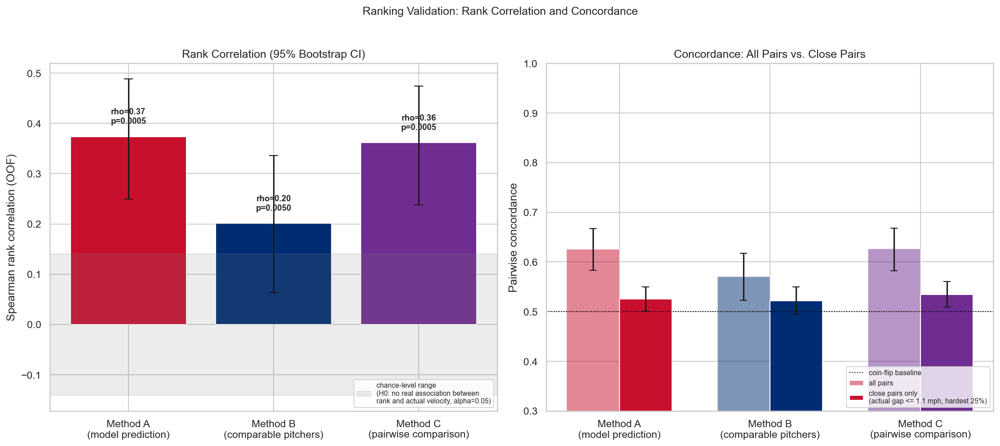{width=80%}

**Figure 13:** *Out-of-fold Spearman rank correlation and pairwise concordance for all three ranking methods, with 95% bootstrap confidence intervals and a close-pairs comparison.*

Several important findings emerged. First, the machine-learning prediction model (Method A) and Bradley-Terry ranking model (Method C) produced nearly identical performance despite being built on fundamentally different learning objectives. Bootstrap comparison of the Spearman correlation difference yielded a confidence interval spanning zero, indicating that the two methods are statistically indistinguishable. In contrast, both methods significantly outperformed the comparable-pitcher framework (Method B), which exhibited weaker but still statistically significant ranking signal.

Second, pairwise concordance alone can be misleading because it includes many trivially easy comparisons between pitchers with large velocity differences. To address this, concordance was recomputed using only "close pairs," defined as pitcher pairs whose actual velocity differed by 1.08 mph or less. These represent the most difficult 25% of comparisons and more closely resemble the decisions faced in practice when differentiating among top prospects.

The close-pair analysis revealed an important limitation. While overall concordance ranged from approximately 57% to 63%, concordance dropped to roughly 52–53% when evaluation was restricted to these difficult comparisons. This suggests that the methods are effective at distinguishing clearly harder throwers from clearly softer throwers, but only modestly better than chance when attempting to order pitchers with very similar velocity profiles.

This limitation is important when interpreting the final rankings. The analysis provides considerably more confidence in separating broad tiers of pitchers than in distinguishing between adjacent ranks. Consequently, small differences in final rank should not be interpreted as definitive evidence that one pitcher is meaningfully superior to another. Rather, pitchers appearing near one another in the final ranking should often be viewed as belonging to a similar tier of future velocity potential.

Despite these limitations, the three methods demonstrated meaningful agreement while remaining only moderately correlated with one another. Inter-method rank correlations ranged from 0.38 to 0.50, indicating that the models were not simply reproducing the same ranking through different implementations. Instead, each method contributed partially independent information while still arriving at broadly similar conclusions.

|               | Method A | Method B | Method C |
|---------------|---------:|---------:|---------:|
| **Method A** | 1.00 | 0.38 | 0.50 |
| **Method B** | 0.38 | 1.00 | 0.44 |
| **Method C** | 0.50 | 0.44 | 1.00 |

This balance is desirable: if the methods were perfectly correlated, little information would be gained from combining them; if they were entirely uncorrelated, confidence in the consensus ranking would be reduced.

The strongest support therefore came not from any individual model, but from pitchers who repeatedly surfaced across all three approaches. Pitchers 212, 132, 154, and 119 (see result sections) consistently appeared among the highest-ranked candidates regardless of methodology, providing evidence that their rankings reflect meaningful biomechanical signal rather than model-specific artifacts.

More importantly, the same biomechanical themes emerged across all three frameworks. Pitchers receiving favorable evaluations consistently exhibited exceptional lower-body loading, rotational acceleration, separation mechanics, or trunk-control characteristics. These biomechanical signals appeared during archetype discovery, survived feature selection, emerged in SHAP explainability, influenced comparable-pitcher matching, and persisted through pairwise ranking.

This convergence is arguably the most important result of the study. Mechanical archetypes revealed multiple pathways to elite velocity, but the highest-ranked pitchers consistently distinguished themselves through exceptional lower-body loading, rotational acceleration, or separation characteristics that persisted across clustering, feature selection, model explainability, comparable-pitcher analysis, Bradley-Terry ranking, and extreme-value projection.

This convergence of evidence suggests that the ranking is capturing meaningful biomechanical signal rather than artifacts of any single model or methodology.

# 7. Building a Consensus Ranking

Because future velocity cannot be observed directly, the final ranking was intentionally constructed from multiple independent methodologies rather than relying on any single model prediction. Each ranking method evaluates future velocity potential from a different perspective. The XGBoost model estimates velocity directly from biomechanical measurements. The comparable-pitcher framework evaluates how a player's mechanics compare to previously observed pitchers. The Bradley-Terry model focuses entirely on relative ordering rather than velocity prediction. Each approach captures different information and carries different assumptions.

The final ranking is based on agreement across methods. The underlying principle is pitchers repeatedly identified as high-upside candidates by multiple independent approaches provide stronger evidence than pitchers elevated by only one model.

Each method produces an independent ranking of the FCL-2025 cohort. 
The final consensus ranking was calculated as the average rank across all three independent methods:

$$\text{Consensus Rank} = \frac{\text{Rank}_{A} + \text{Rank}_{B} + \text{Rank}_{C}}{3}$$

where Method A is the XGBoost biomechanical prediction model, Method B is the nearest-neighbor comparable-pitcher framework, and Method C is the Bradley-Terry pairwise ranking model.

This approach intentionally rewards pitchers who perform well across multiple independent evaluation frameworks while reducing sensitivity to the assumptions of any individual method.

Inter-method Spearman correlations ranged from approximately 0.56 to 0.66, indicating meaningful agreement while preserving methodological independence. Of the top ten pitchers identified by each method individually, only four appeared in all three top-ten lists simultaneously. This result is important: agreement among methods is real, but not automatic. Consequently, a pitcher reaching the consensus top ten by averaging three partially independent rankings provides substantially stronger evidence than simply leading any one model alone.

The consensus ranking therefore serves as the foundation for all subsequent uncertainty quantification and future velocity projections. Rather than representing the output of a single model, it reflects the convergence of multiple independent views of future velocity potential. However, a consensus rank alone does not quantify uncertainty. The next step is to translate these rankings into probability distributions that capture model uncertainty, player development, and future performance variability.

# 8. Quantifying Uncertainty for Five-Year Forecasting

The consensus ranking identifies pitchers who consistently demonstrate future velocity potential across multiple independent methods. However, the ranking itself does not quantify uncertainty or estimate how hard those pitchers may ultimately throw. To address this, future velocity was modeled as a distribution rather than a single prediction.

In other words, the consensus framework answers who projects best, while the extreme-value framework answers how hard those pitchers may ultimately throw.

## 8.1 Model Uncertainty

The first source was model uncertainty. Rather than relying on a single XGBoost fit, the labeled pitcher population was repeatedly resampled and the model refit 200 times. This produced 200 alternative projections for every FCL pitcher, reflecting uncertainty in the relationship between biomechanics and velocity learned from the available data.

The second source was development uncertainty. Because the objective is to forecast performance five years into the future, current biomechanics cannot be treated as a fixed endpoint. Year-over-year velocity changes from the small subset of multi-season pitchers in the labeled dataset were used to generate a distribution of plausible future development outcomes. Although this estimate is based on a limited sample, it provides a more realistic representation of future growth than assuming no development at all.

The third source was pitch-to-pitch variability. Even pitchers with identical underlying ability do not throw every pitch at the same velocity. A population-level velocity standard deviation was therefore incorporated to represent normal variation in future pitch outcomes.

The ranking method identifies pitchers who repeatedly demonstrate favorable biomechanical characteristics across independent methods. However, the question asks something more specific: who will throw the hardest pitch five years from now? Answering that requires more than a consensus score. It requires modeling uncertainty and projecting each pitcher's upper-tail velocity outcome.

The model and development uncertainties were combined draw-by-draw to create a posterior distribution of future velocity potential for every pitcher. Each bootstrap realization of the biomechanical model was paired with a corresponding development realization, producing 200 plausible future estimates of underlying velocity potential. These posterior draws represent alternative future scenarios that incorporate both uncertainty in the biomechanics-to-velocity relationship and uncertainty in long-term player development.

## 8.3 Extreme Value Projection: The Gumbel Distribution

The posterior distribution developed above estimates a pitcher's future underlying ability level. However, scouts are rarely interested in average future performance. The practical question is which pitcher possesses the highest future velocity ceiling. To answer that question, the posterior distribution was propagated through an extreme-value simulation framework.

These simulated maxima were compared against fitted Gumbel distributions, the classical extreme-value model for maxima of repeated observations. The Gumbel framework was used as a diagnostic tool to verify that the simulated ceiling distributions behaved as expected under extreme-value theory. The final ranking metric was expected_max, defined as the mean of the simulated maximum distribution. This approach rewards pitchers who consistently project to possess a higher velocity ceiling across many plausible futures rather than benefiting from a single favorable simulation.

For the top-ranked pitchers, the upper tail of this same simulated maximum distribution reaches notably higher than the average projection: Pitcher 212's distribution extends as high as 103.23 mph, with Pitchers 132 and 154 reaching 99.95 mph and 101.22 mph, respectively. These upper-bound values are not point predictions, but rather they show that the same posterior simulations driving the consensus ranking also support genuinely elite single-pitch velocity ceilings for the highest-ranked prospects.

Sensitivity analyses showed that the rankings were highly stable across different simulation sizes (rank correlation > 0.99), indicating that the results were driven by underlying biomechanical differences rather than simulation artifacts.

One caveat is worth noting. For the top consensus pitcher (212), the Gumbel goodness-of-fit test produced a KS-test p-value of 0.023, formally rejecting the fitted distribution at the 0.05 level. This does not materially affect the ranking because the analysis relies on the empirical simulated maximum distribution and its mean rather than a specific tail probability implied by the fitted Gumbel curve.

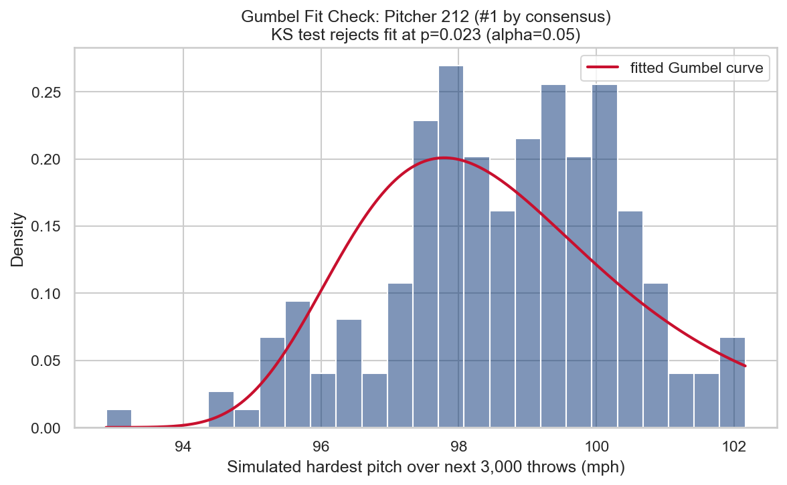{width=80%}

**Figure 14:** *Kolmogorov-Smirnov goodness-of-fit check of the fitted Gumbel curve against the simulated maximum-velocity distribution for the #1 consensus-ranked pitcher.*

Importantly, this extreme-value framework does not determine the consensus ranking. The consensus ranking identifies pitchers most consistently supported by independent biomechanical evidence, while the extreme-value analysis quantifies the velocity ceilings associated with those pitchers.

# 9. Final Rankings and Results

The framework identified five pitchers who consistently demonstrated elite future velocity potential across independent biomechanical, statistical, and ranking-based evaluation methods. 
These pitchers repeatedly emerged near the top of the rankings despite being evaluated through fundamentally different modeling assumptions.

\newpage

**Table 1.** Final consensus ranking summary for the top 5 FCL-2025 pitchers.

| Final Rank | Pitcher ID | Projected Ceiling (mph) | Consensus Rank Score | Mechanical Archetype |
|------------|------------|------------------------:|---------------------:|---------------------:|
| 1 | 212 | 98.66 | 1.7 | 0 |
| 2 | 132 | 97.91 | 3.3 | 2 |
| 3 | 154 | 98.57 | 3.3 | 2 |
| 4 | 199 | 97.80 | 6.3 | 6 |
| 5 | 198 | 98.43 | 7.3 | 4 |

A notable result is that the top-ranked pitchers emerged from multiple mechanical archetypes rather than a single dominant movement profile. This finding suggests there is no universal biomechanical blueprint for elite velocity production; instead, several distinct mechanical pathways appear capable of generating high-end velocity potential.

Although the methods were built using fundamentally different assumptions, the highest-ranked pitchers consistently appeared near the top of all three rankings, providing evidence that the results are not artifacts of a particular modeling approach.

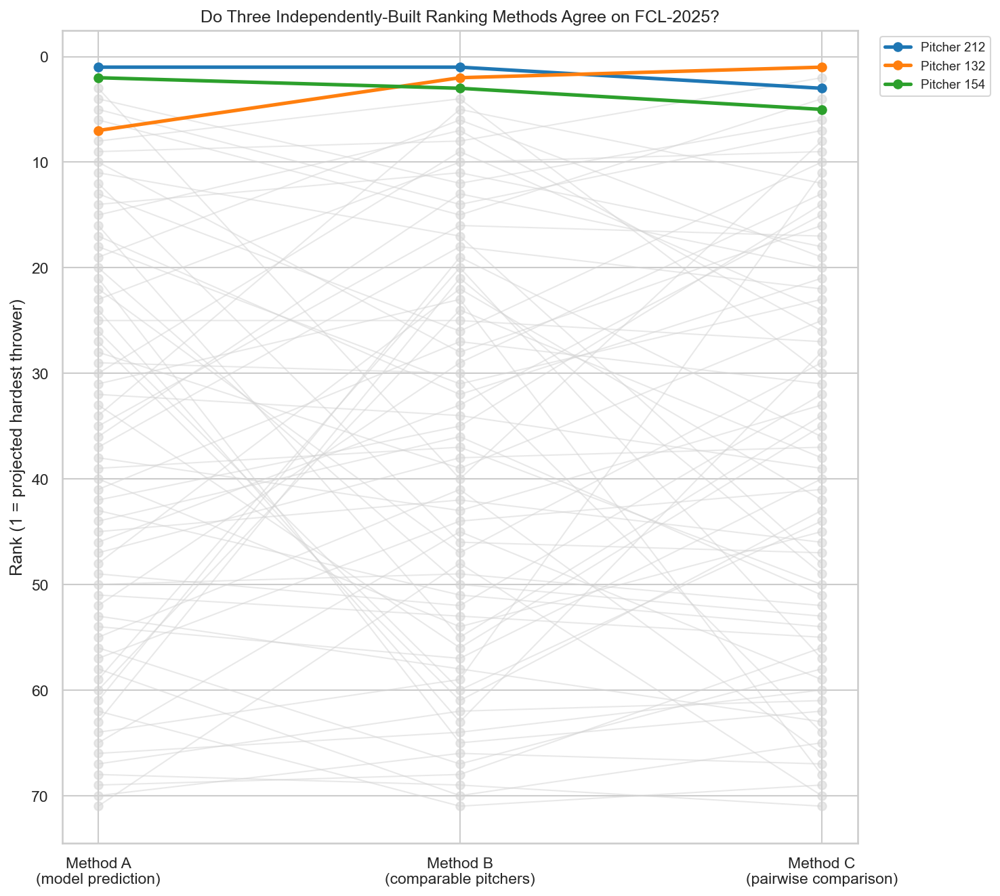{width=80%}

**Figure 15:** *Rank assigned to each FCL-2025 pitcher by each of the three independent methods, with the top 3 consensus-ranked pitchers highlighted.*

The final rankings were not determined directly from the projected velocity ceilings shown in Table 1. Instead, pitchers were first ranked using the consensus framework described in Section 7, which combines the independent rankings from the XGBoost prediction model, comparable-pitcher analysis, and Bradley-Terry pairwise ranking model. The posterior and extreme-value framework described in Section 8 was then applied to those consensus-ranked pitchers. 

Once the consensus rankings were established, uncertainty was quantified through a posterior simulation framework. Bootstrap resampling generated distributions of future velocity potential that incorporated both model uncertainty and projected player development. For each posterior realization, thousands of future pitches were simulated and the maximum velocity recorded. Repeating this process produced an empirical distribution of future velocity ceilings for every pitcher.

A Gumbel extreme-value fit was then used to characterize these ceiling distributions and estimate each pitcher's expected maximum velocity. The final evaluation combines two complementary perspectives: the consensus ranking identifies which pitchers are most consistently supported by the biomechanical evidence, while the extreme-value framework quantifies how hard those pitchers may ultimately throw.

## 9.1 Convergence on Lower-Body Power Generation
The defining result of this analysis is not simply the identification of Pitcher 212 as the top-ranked prospect. Rather, it is the convergence of multiple independent analytical frameworks toward a common biomechanical theme: elite future velocity potential appears to be strongly associated with the ability to generate, store, and transfer rotational force from the lower half through the kinetic chain. The following case studies exhibit this core concept.

Pitcher 212, the top-ranked pitcher overall, exhibited the strongest lower-body loading profile in the cohort. His two largest deviations from the FCL-2025 population were back-knee flexion at foot plant (+4.9 SD) and back-hip flexion at foot plant (+3.2 SD). These measurements represent some of the largest lower-body deviations observed in the entire dataset and suggest an exceptional capacity to generate and store force prior to rotational acceleration. Figure 16 highlights the magnitude of these loading characteristics.

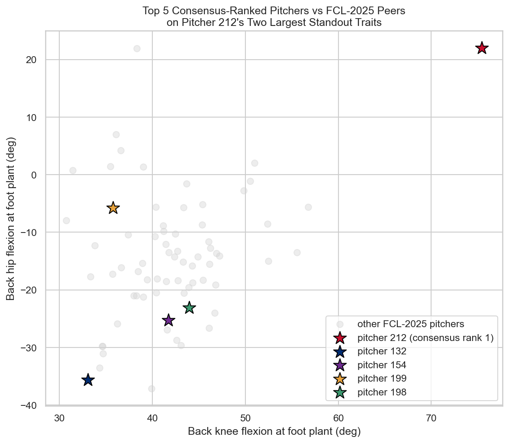{width=80%}

**Figure 16:** *Pitcher 212's two largest mechanical deviations from the FCL-2025 peer population, compared against the other top consensus-ranked pitchers.*

Pitcher 132 further reinforces this biomechanical theme. His defining characteristic is torso rotational velocity (+5.1 SD), the single largest rotational-speed deviation observed among the top-ranked pitchers. His profile is dominated by explosive rotational acceleration and the rapid transfer of energy through the trunk.

Pitcher 154 reaches an elite projection through exceptional rotational mechanics. His profile is characterized by exceptional pelvis rotational velocity (+6.4 SD) and hip-shoulder separation (+4.6 SD). These characteristics suggest an unusually efficient ability to transfer rotational energy generated starting with lower half rotation power into the upper body before ball release. 

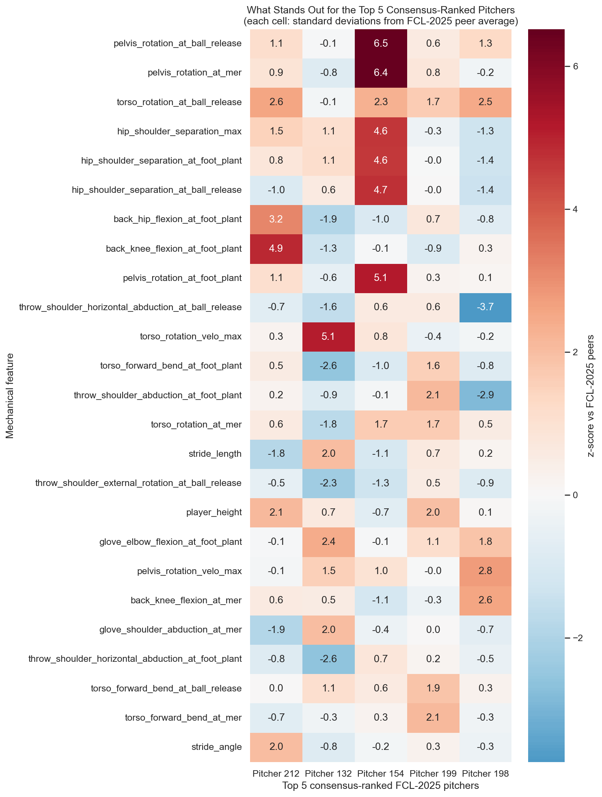{width=80%}

**Figure 17:** *Z-scored standout mechanical features for each of the top 5 consensus-ranked pitchers, relative to the FCL-2025 peer population.*

The top prospects consistently distinguished themselves through characteristics associated with lower-body force generation and the subsequent acceleration and transfer of rotational energy through the lower half of the kinetic chain. Pitcher 212 exhibited elite force-loading characteristics through exceptional back-knee and back-hip flexion. Pitcher 132 demonstrated elite rotational power through extraordinary torso rotational velocity. Pitcher 154 displayed elite rotational transfer through exceptional pelvis rotational velocity and hip-shoulder separation. The same underlying biomechanical process emerged: generating force in the lower half, accelerating rotational energy through the trunk, and efficiently transferring that energy through the kinetic chain. 

The convergence observed in the biomechanical analysis is ultimately reflected in the projected velocity ceilings. Figure 18 shows the posterior extreme-value distributions for the three highest-ranked pitchers. Despite differences in individual mechanical measurements, all three project to possess elite future velocity ceilings approaching 98–99 mph, providing further evidence that exceptional lower-body-driven power generation is associated with high-end velocity potential.

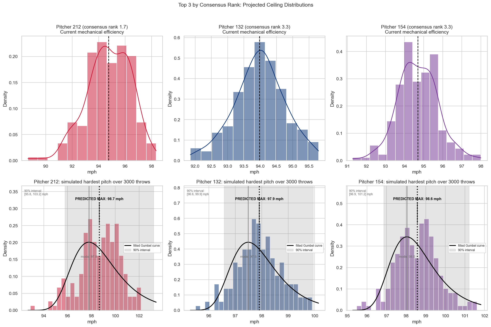{width=80%}

**Figure 18:** *Posterior mechanical-efficiency distributions and simulated hardest-pitch projections for the top 3 consensus-ranked pitchers.*

Table 2 reports these projections numerically. The expected max is the average outcome across 200 posterior simulations of 3,000 simulated pitches each: effectively, the hardest pitch a pitcher would be projected to throw on a typical day given his current mechanical efficiency and projected five-year development. The 90% interval captures the full range of plausible outcomes across those same simulations, from an unfavorable draw on the low end to a favorable one on the high end. The upper bound of that interval is best read as a ceiling on the ceiling: not an expected outcome, but the hardest single pitch that becomes plausible if model uncertainty and player development both break favorably. For Pitcher 212, that upper bound reaches 103.23 mph, the highest projected value of any pitcher in the FCL-2025 cohort, consistent with his position as the top-ranked prospect across all three independent ranking methods. Pitchers 132 and 154 show comparably elevated upper bounds of 99.95 mph and 101.22 mph, respectively, further evidence that their high consensus rankings reflect genuinely elevated upper-tail velocity potential rather than a single favorable assumption.

**Table 2.** Posterior extreme-value projections for the top 3 consensus-ranked pitchers.

| Pitcher ID | Most Likely Single Pitch (mph) | Expected Max (mph) | 90% Interval (mph) |
|------------|--------------------------------:|--------------------:|--------------------:|
| 212 | 97.79 | 98.66 | 95.78 – 103.23 |
| 132 | 97.49 | 97.91 | 96.58 – 99.95 |
| 154 | 98.04 | 98.57 | 96.86 – 101.22 |

# 10. Summary 

The central hypothesis of this analysis was that future velocity potential is driven by a pitcher's ability to generate, store, and transfer force through the kinetic chain.
To evaluate this hypothesis, biomechanical archetypes, machine-learning prediction, comparable-pitcher analysis, pairwise ranking models, posterior uncertainty estimation, and extreme-value projection were combined into a unified ranking framework.

The results consistently supported this hypothesis. Across multiple independent analytical methods, the highest-ranked pitchers repeatedly distinguished themselves through characteristics associated with lower-body force generation, rotational acceleration, and rotational energy transfer. Pitcher 212 emerged as the top overall prospect, while Pitchers 132 and 154 reinforced the same underlying biomechanical theme through exceptional rotational characteristics. 

While no model can perfectly forecast a player's future development, the convergence of evidence across multiple independent analytical frameworks provides confidence that the rankings are capturing meaningful biomechanical signal rather than model-specific artifacts.

More importantly, the same biomechanical theme emerged repeatedly across archetype discovery, feature selection, model explainability, comparable-pitcher analysis, consensus ranking, and extreme-value projection. The final deliverable is therefore more than a ranking, it is evidence that lower-body-driven rotational power generation is a defining characteristic of elite future velocity potential.

# 11. Limitations

Several limitations should be acknowledged.

* **No age or maturation information was available.** Five-year development was modeled using a population-level adjustment rather than individualized growth curves. Consequently, differences in biological maturation, strength development, injury history, and training environment could not be incorporated directly.

* **The multi-season development sample was limited.** The subset of pitchers observed across both seasons was relatively small, meaning the projected development adjustment should be interpreted as a coarse estimate rather than a precise forecast of future growth.

* **Pitch-to-pitch variability was modeled using a population-average estimate.** An individualized variance model was explored but did not generalize reliably and was therefore excluded from the final framework.

* **Covariate shift remains possible.** Some FCL-2025 pitchers occupy regions of biomechanical space that are only sparsely represented in the labeled training population. Agreement across independent methods and comparable-pitcher similarity scores provide safeguards against overconfidence, but extrapolation risk cannot be eliminated entirely.

* **Biomechanics explain only part of velocity.** Strength, intent, fatigue, pitch design, and measurement noise are not observed in the dataset. The objective of the analysis is therefore not precise pitch-level velocity prediction, but rather the identification and ranking of future velocity potential.

* **Pitcher-specific sample size is not fully reflected in uncertainty estimates.** The current framework captures uncertainty in the biomechanics-to-velocity relationship but does not explicitly increase uncertainty for pitchers whose biomechanical profiles are derived from relatively few recorded pitches.

